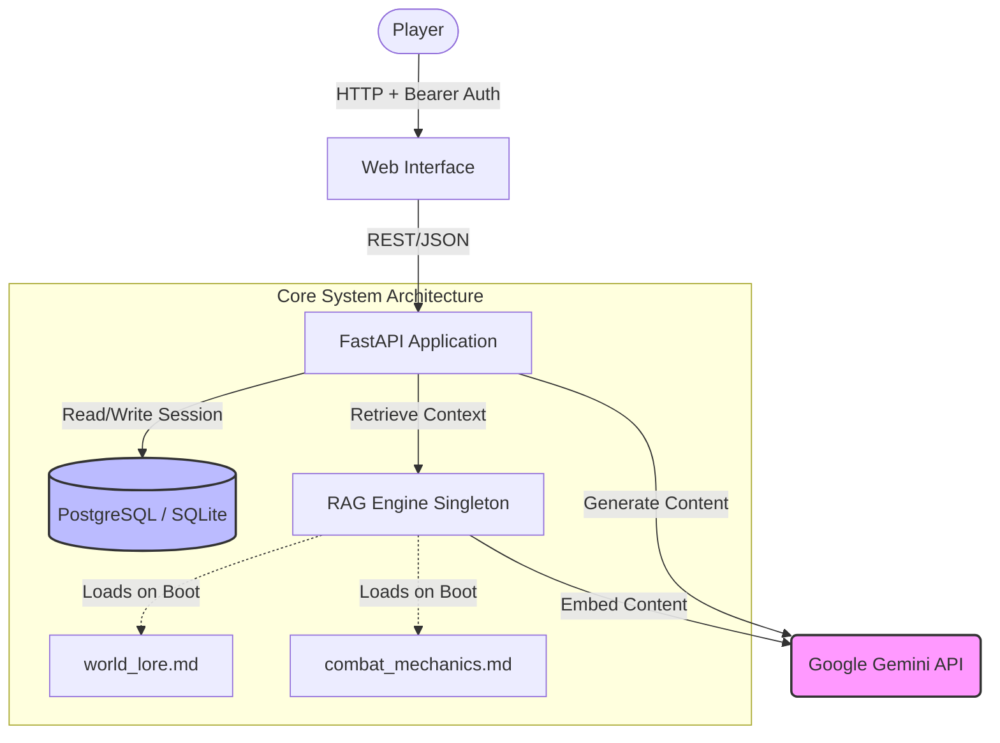

# Architecture: The Blackwood Anomaly

The Blackwood Anomaly is designed as a stateless, API-first application that orchestrates complex LLM interactions while enforcing persistent game mechanics via a Retrieval-Augmented Generation (RAG) pipeline.

## System Diagram

The following diagram illustrates the flow of data between the player, the FastAPI backend, the local database, and the external Google Gemini API.

## Core Components

### 1. FastAPI Application (`api.py`)

The central orchestrator of the game. It handles routing, dependency injection, and security.

- **Stateless BYOK:** The server extracts the user's API key from the incoming request and instantiates an isolated `LLMProvider`. Supports Gemini, OpenAI, and OpenRouter via the `X-LLM-Provider` header.
- **Agentic Loop:** The API handles `function_calls` from the LLM, executing local Python tools (like `roll_d20`), and feeding the results back for a final generated narrative.
- **Regex State Extraction:** After the LLM generates a narrative response, the API parses the required `[Health: X% | Stress: Y%]` suffix using Regular Expressions.
- **Session Recap (`POST /recap`):** Compresses prior session history into a labelled transcript and invokes the LLM in MODE 2 (Session Recap) to generate a clinical, atmospheric summary for returning players. Vitals tag is suppressed in this mode to protect the regex extractor.

### 2. RAG Engine Singleton (`rag.py`)

A custom-built, dependency-free Vector Search engine optimized for low-resource environments.

- **Lazy-Loaded Embeddings:** To prevent unnecessary API costs and accommodate the BYOK architecture, the engine parses local Markdown files on boot but *waits* to generate vector embeddings until the first user request provides an API key.
- **State-Aware Retrieval:** The engine constructs a query combining the player's proposed action with their current numerical vitals, ensuring that the fetched context is highly relevant to their immediate situation.

### 3. Database Layer (`database.py`)

Manages the persistence of the game loop across individual REST calls.

- **SQLAlchemy ORM:** Provides an abstraction layer over the database, allowing the system to seamlessly switch between a local SQLite file (for rapid testing) and a production-grade PostgreSQL container.
- **JSON History:** The player's entire conversation history is persisted in a JSON column, allowing the FastAPI route to rebuild the LLM's conversational memory on every stateless request.

### 4. Knowledge Base (`data/`)

The static, verified truth that anchors the LLM.

- `world_lore.md`: Defines the atmospheric boundaries, aesthetic (Medical Brutalism), and narrative constraints.
- `combat_mechanics.md`: Hard-coded rules that the LLM must follow to deduct health or apply stress based on player actions.
- `storyteller_guide.md`: The core Game Master system prompt, loaded dynamically per request. Contains:
  - **Persona** — "Medical Brutalism" aesthetic and writing style constraints.
  - **Core Premise** — Hard-coded WHO/WHAT/WHERE/WHY lore block: *The Blackwood Institute* (location), *Subject 814* (player identity), *The Anomaly* (inciting event), and the escape objective. Grounded context injected on every LLM call.
  - **Core Directives** — Show-don't-tell, absolute player agency, and brevity rules.
  - **Game Loop** — Resolve → Advance → Prompt narrative structure.
  - **Output Guardrail** — Enforces the `[Health: X% | Stress: Y%]` regex target on every response.
  - **Session Modes** — Two keyed behavioral modes: MODE 1 (`"Start the game."`) for cinematic new-game openings and MODE 2 (`"Recap the session."`) for clinical returning-player summaries with vitals tag suppressed.

## Security & Privacy

Because of the **Bring-Your-Own-Key (BYOK)** architecture, no API traffic is routed through centralized proxy servers, and no usage is billed to the host. The local database ensures that session transcripts remain strictly within the user's deployed instance.
